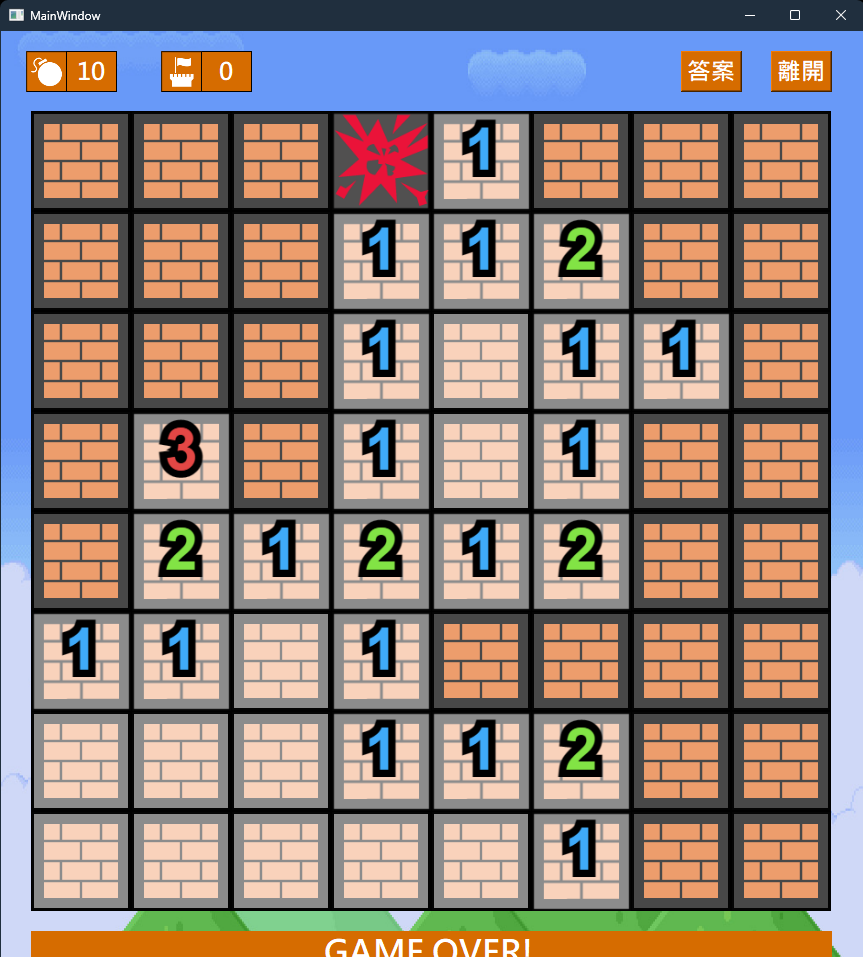
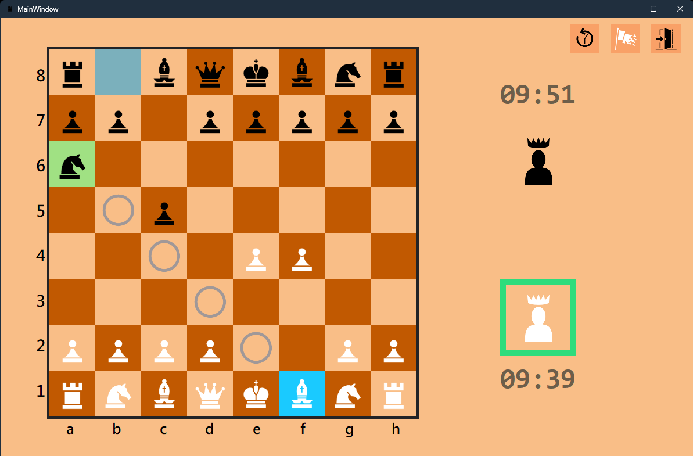

<h1 align="center">Chia-Cheng Liu</h1>
<h3 align="center">Email: frgnd5433@gmail.com</h3>

<h2 align="left">Education</h2>

<h3 font-weight="bold">National Taiwan University of Science and Technology (Taiwan Tech)</h3>
<h4>Bachelor of Science, Computer Science and Information Engineering</h4>

Sep. 2019 - Jun. 2025

Data Structure, Object Oriented programming, Compiler Design, Operating System, Data Science, AI usage and application apply

<h2 align="left">Technical Skills</h2>
<h3 align="left">Languages and Tools:</h3>

<h4 align="left">Programming Languages:</h4>

  
  
  
  
    
  

      
<h4 align="left">Web Development:</h4>

  
  

<h4 align="left">Tools and Platforms:</h4>

  
  

<h2 align="left">Projects and works</h3>

<h4 align="left">
  <a href="https://ccoliu.github.io/Webs/index.html" target="_blank">Codoctopus Website</a>
</h4>

  Codoctopus is a fully automated task division robot. It automatically splits your work into different tasks and executes them step by step, currently used for writing code and other tasks.

  

<h4 align="left">
  <a href="https://github.com/ccoliu/Minesweeper" target="_blank">Minesweeper</a>
</h4>

  Minesweeper is a classic original game that player must completely find all the blocks that is not mine.

  

<h4 align="left">
  <a href="https://github.com/ccoliu/Chess" target="_blank">Chess</a>
</h4>

  Chess is an abstract strategy game game that two players play on the board until one of player's king has been eliminated.

  

