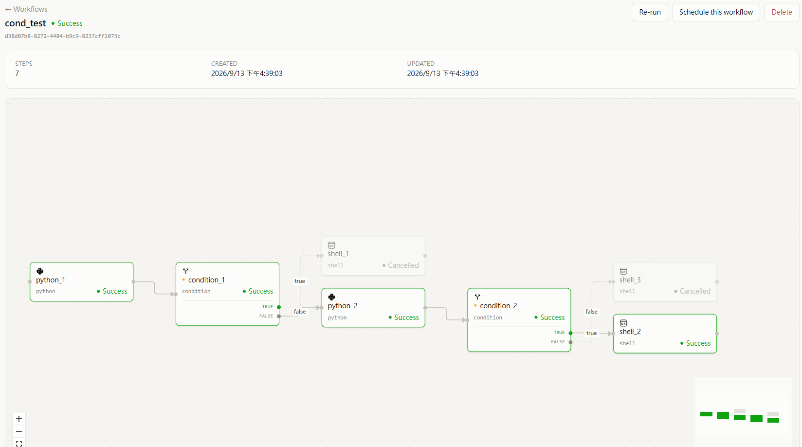
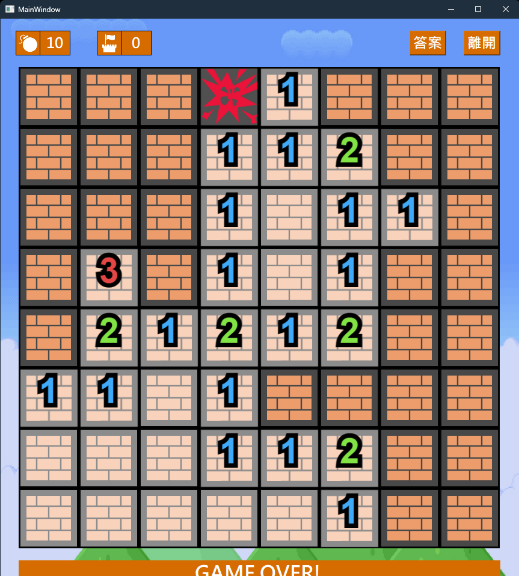
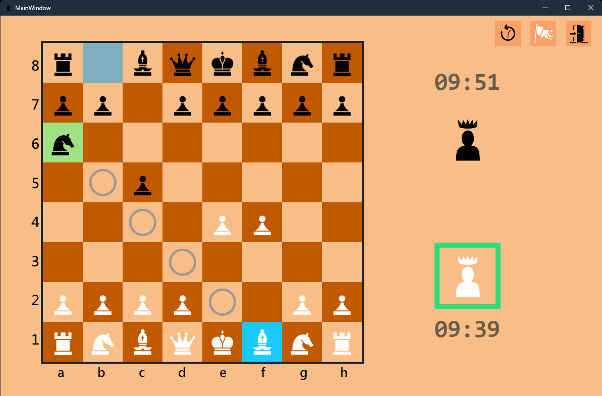

<h1 align="center">Chia-Cheng Liu</h1>
<h3 align="center">Email: frgnd5433@gmail.com</h3>

<h2 align="left">About Me</h2>

  Software engineer with a CS degree from Taiwan Tech. I build backend and systems software — distributed task scheduling, LLM agent orchestration, embedded/BMC simulation — and do deep-learning research on cross-domain few-shot learning.

<h2 align="left">Education</h2>

<h3 font-weight="bold">National Taiwan University of Science and Technology (Taiwan Tech)</h3>
<h4>Bachelor of Science, Computer Science and Information Engineering</h4>

Sep. 2019 - Jun. 2025

Data Structures, Object-Oriented Programming, Compiler Design, Operating Systems, Data Science, Applied AI

<h2 align="left">Technical Skills</h2>

<h4 align="left">Programming Languages:</h4>

  
  
  
  
  
  
  

<h4 align="left">Backend &amp; Web:</h4>

  
  
  
  
  

<h4 align="left">Data &amp; AI:</h4>

  
  
  

<h4 align="left">Tools &amp; Platforms:</h4>

  
  
  
  

<h2 align="left">Projects</h2>

<h3 align="left">
  <a href="https://github.com/ccoliu/Codoctopus" target="_blank">Codoctopus</a> 🐙
</h3>

  A provider-neutral agent orchestration framework. Give it a goal and it decomposes the goal into a verified task DAG, then runs each step with agents that can actually act — read and write files, run shell commands and tests, and make HTTP requests. Works with Anthropic, OpenAI, Gemini, Ollama, or any OpenAI-compatible gateway, and ships with a CLI, a Python SDK, and a React web GUI.

<i>Python · asyncio · Pydantic · FastAPI · React · TypeScript</i>

  

<h3 align="left">
  <a href="https://github.com/ccoliu/coworkify" target="_blank">Coworkify</a>
</h3>

  A distributed task scheduling and execution platform inspired by Apache Airflow and Celery. Supports the full task lifecycle, priority queues, delayed and cron-based scheduling, retries with exponential backoff, DAG workflows with a drag-and-drop visual builder, Redis sliding-window rate limiting, and real-time status push over WebSocket.

<i>FastAPI · Celery · PostgreSQL · Redis · React · Docker Compose</i>

  

<h3 align="left">
  <a href="https://github.com/ccoliu/mini-bmc" target="_blank">mini-bmc</a>
</h3>

  A self-contained simulator of a server BMC (Baseboard Management Controller): a <code>poll()</code>-based C daemon that simulates sensors and fault injection, with a DMTF Redfish REST API on top. Every response is validated against the official Redfish schemas in CI, and the C code is tested with Unity under ASan/UBSan. No hardware required — just <code>docker compose up</code>.

<i>C11 · Python · FastAPI · Redfish · Docker · GitHub Actions</i>

<h3 align="left">
  <a href="https://github.com/ccoliu/FeatureSR" target="_blank">FeatureSR</a>
</h3>

  Research on feature-level super-resolution for vision-language cross-domain few-shot learning. Upsamples ViT patch tokens from 14×14 to 28×28 with a cross-resolution consistency loss, built on cycle-consistent vision-language alignment (CC-CDFSL). Improves 5-way 5-shot accuracy on all four benchmarks (EuroSAT, CropDiseases, ISIC 2018, ChestX), +1.15% on average.

<i>Python · PyTorch · CLIP · LoRA</i>

<h2 align="left">Earlier Projects</h2>

<h4 align="left">
  <a href="https://github.com/ccoliu/Minesweeper" target="_blank">Minesweeper</a>
</h4>

  The classic game: uncover every block that doesn't hide a mine.

  

<h4 align="left">
  <a href="https://github.com/ccoliu/Chess" target="_blank">Chess</a>
</h4>

  A two-player chess game, played on the board until one side's king is captured.

  

